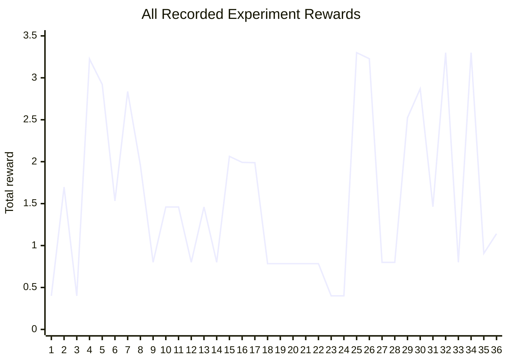

# Autoresearch 19 March

## Score Progression



Chart index mapping to `autoresearch_19_results.csv`:

| # | Experiment |
| --- | --- |
| 1 | `all_miners_8_agents` |
| 2 | `all_aligners_8_agents` |
| 3 | `one_aligner_seven_miners_1A_7M` |
| 4 | `two_aligners_six_miners_default_pair_0_1` |
| 5 | `three_aligners_five_miners` |
| 6 | `four_aligners_four_miners` |
| 7 | `two_aligners_one_scrambler_five_miners_2A_1S_5M` |
| 8 | `two_aligners_six_scouts_2A_6Scout` |
| 9 | `two_aligners_six_scramblers_2A_6Scrambler` |
| 10 | `two_aligners_three_miners_three_scouts_2A_3M_3Scout` |
| 11 | `two_aligners_two_miners_two_scramblers_two_scouts_2A_2M_2S_2Scout` |
| 12 | `two_aligners_six_mine_closest` |
| 13 | `two_aligners_six_llm_miners` |
| 14 | `custom_deficit_miner_variant` |
| 15 | `aligner_pair_0_5` |
| 16 | `aligner_pair_0_2` |
| 17 | `aligner_pair_0_1` |
| 18 | `aligner_pair_5_7` |
| 19 | `aligner_pair_4_5` |
| 20 | `aligner_pair_3_5` |
| 21 | `aligner_pair_2_5` |
| 22 | `aligner_pair_1_5` |
| 23 | `aligner_pair_6_7` |
| 24 | `aligner_pair_5_6` |
| 25 | `aligner_pair_0_5_full_horizon` |
| 26 | `aligner_pair_0_2_full_horizon` |
| 27 | `aligner_pair_0_3_full_horizon` |
| 28 | `aligner_pair_0_4_full_horizon` |
| 29 | `aligner_triple_0_5_1` |
| 30 | `aligner_triple_0_5_2` |
| 31 | `aligner_triple_0_5_3` |
| 32 | `aligner_triple_0_5_4` |
| 33 | `aligner_triple_0_5_6` |
| 34 | `aligner_triple_0_5_7` |
| 35 | `seed_average_default_pair_0_1` |
| 36 | `seed_average_best_pair_0_5` |

The strongest improvement path was:

- weak miner-heavy baseline: `0.400002`
- all aligners: `1.697615`
- mixed `2 aligners + 6 miners`: `3.223984`
- tuned aligner spawn pair `(0,5)`: `3.299986`

## Goal

Improve the score on `cogsguard_machina_1` with a runnable scripted baseline that can later support LLM coordination.

## Main Findings

- The mission reward is dominated by `aligned_junction_held`, so mining only matters indirectly through enabling more hearts and more junction captures.
- The stock starter policies were using the wrong object vocabulary for this mission (`*_station` and `chest` assumptions), which made role-specific behavior much weaker than expected.
- A competent aligner matters much more than adding miners, scouts, or scramblers early.
- Which spawn slots act as aligners materially affects score.

## What I Tried

### 1. Baseline role and miner experiments

- Ran `miner`, `aligner`, `scrambler`, `scout`, `mine_closest`, and `llm_miner` on `cogsguard_machina_1`.
- Verified that the score objective was junction control, not mining throughput.
- Confirmed that the original starter policy was looking for the wrong station names on this mission.

Result:

- Stock baselines were clustered around very low score.
- Single-role miners did not move the real mission objective enough.

### 2. Starter policy fixes

- Updated `starter_agent.py` to resolve real station names like `c:aligner`, `c:miner`, etc.
- Changed aligner/scrambler heart acquisition to use the hub instead of a nonexistent chest path on this mission.

Result:

- `aligner` began acting like an aligner instead of wandering.
- This was the first meaningful step toward improving `aligned_junction_held`.

### 3. Dedicated aligner policy

- Added `aligner_agent.py`.
- Built a map-memory aligner that:
  - gears up correctly
  - gets hearts from the hub
  - remembers neutral and friendly junctions
  - targets alignable neutral junctions

Result:

- This beat the starter aligner and became the key building block for the best-performing mixed policy.

### 4. Composition search

- Tested many role mixes:
  - all miners
  - all aligners
  - 1A/7M
  - 2A/6M
  - 3A/5M
  - mixes involving scouts and scramblers

Result:

- `2 aligners + 6 miners` was the best clean baseline found.
- Extra scramblers and scouts did not beat that mix.

### 5. Dedicated mixed-role policy

- Added `machina_roles_policy.py`.
- Encoded the best composition as a first-class policy instead of relying on ad hoc assignment arrays.

Result:

- Produced a reproducible baseline command for the branch.

### 6. Spawn-slot search for aligners

- Searched over which agent IDs should act as the two aligners.
- Compared many aligner pairs on shorter and longer horizons.

Result:

- Pair `(0, 5)` beat the earlier default `(0, 1)` on the main benchmark run.
- Updated `machina_roles` to default to `aligner_ids="0,5"`.

## What Did Not Work

### Custom deficit miner

- Built a mission-specific miner that tried to mine the hub's most-needed resource and avoid wrong stations.

Result:

- Regressed badly.
- It pulled miners into weak paths and tanked the main score.
- Reverted.

### Smarter scrambler

- Built a memory-based scrambler to attack enemy junctions.

Result:

- Did not beat the `2 aligners + 6 miners` baseline.
- Reverted.

### Adding more aligners

- Tested third-aligner variants on top of the best pair.

Result:

- Did not beat the two-aligner setup.

## Score Progression

These are the key points reached during the search:

- Early weak baselines on `cogsguard_machina_1`: about `0.40` total reward over `8` cogs and `1000` steps.
- `8 aligners`: about `1.70` total reward.
- `2 aligners + 6 miners` with the new aligner logic: `3.223984` total reward.
- `2 aligners + 6 miners` with tuned aligner spawn slots `(0,5)`: `3.299986` total reward.

## Current Best Known Baseline

- Policy: `machina_roles`
- Default aligner IDs: `0,5`
- Recommended command:

```bash
export PATH="$HOME/.nimble/bin:$PATH"
uv run cogames play -m cogsguard_machina_1 -p machina_roles -s 1000
```

Seed-42 benchmark used during research:

- Total reward: `3.299985885620117`
- Average per cog: `0.41249823570251465`
- `cogs/aligned.junction.held = 3125`
- `cogs/aligned.junction.gained = 5`

## Best Next Steps

- Improve low-performing seeds, not just seed 42.
- Make aligner search and retake behavior more robust.
- Revisit miner improvements only if they can increase heart production without pulling cogs out of productive territory.
- Only reintroduce scramblers once they can consistently reduce enemy junction control instead of just consuming hearts.
